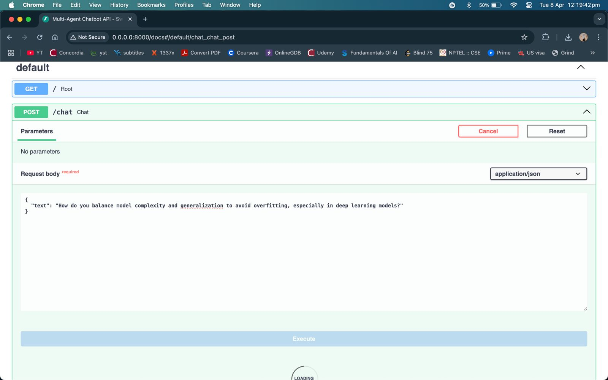
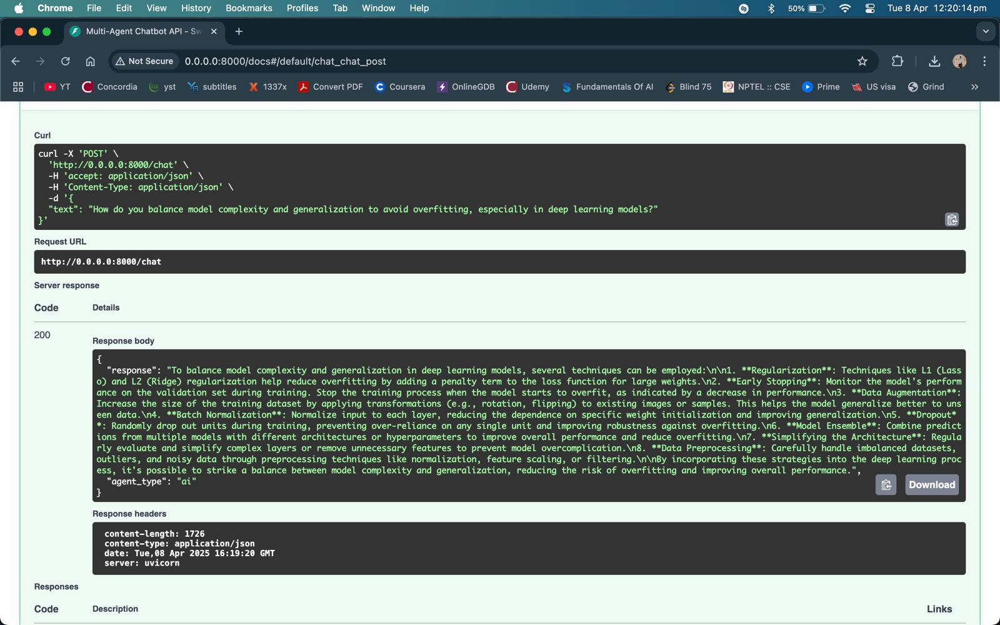

# OllamaChatbot - Multi-Agent LLM Chatbot System

A FastAPI-based multi-agent chatbot system that routes user queries to specialized agents (General, Admission, AI) using reinforcement learning.

## Features

- **Multi-Agent Architecture**: Routes queries to the most appropriate specialized agent
- **Reinforcement Learning**: Improves routing decisions based on user feedback
- **FAISS Vector Database**: Maintains conversation context using vector embeddings
- **Wikipedia Integration**: Augments responses with factual information

## Installation

1. Clone the repository
2. Install dependencies:
   ```
   pip install -r requirements.txt
   ```
3. Ensure [Ollama](https://ollama.ai/) is installed

## Usage

1. Start Ollama server with Llama 3.1:

   ```
   ollama serve
   ```

2. Run the FastAPI application:

   ```
   python run.py
   ```

3. Access the API documentation:

   ```
   http://0.0.0.0:8000/docs
   ```

4. Alternatively, run the CLI interface:
   ```
   python -m agents.cli
   ```

## API Endpoints

- `GET /`: Check system status
- `POST /chat`: Send a query to the chatbot
- `POST /feedback`: Submit feedback (1-5) for the last response
- `GET /metrics`: Retrieve system performance metrics

## Project Structure

- `api.py`: FastAPI endpoints and application setup
- `run.py`: Application entry point
- `BaseAgent.py`: Compatibility layer for the agents package
- `agents/`: Core package containing the modular components
  - `__init__.py`: Package exports
  - `coordinator.py`: Agent selection and routing
  - `base_agent.py`: Base and specialized agent implementations
  - `memory.py`: Conversation memory and FAISS vector database
  - `metrics.py`: Performance tracking and analytics
  - `learning.py`: Reinforcement learning for query routing
  - `utils.py`: Shared models and helper functions
  - `cli.py`: Command-line interface

## How It Works

1. User queries are analyzed by the coordinator
2. Queries are routed to the most appropriate specialized agent:
   - **General Agent**: Default for general queries with FAISS memory
   - **Admission Agent**: Handles university admission questions
   - **AI Agent**: Answers AI-related questions with AI expertise
3. Agents use Wikipedia integration for factual queries
4. Reinforcement learning continuously improves routing decisions based on:
   - User feedback scores
   - Response coherence metrics
5. Performance metrics track agent usage and effectiveness

## Example Usage

### Request



### Response


